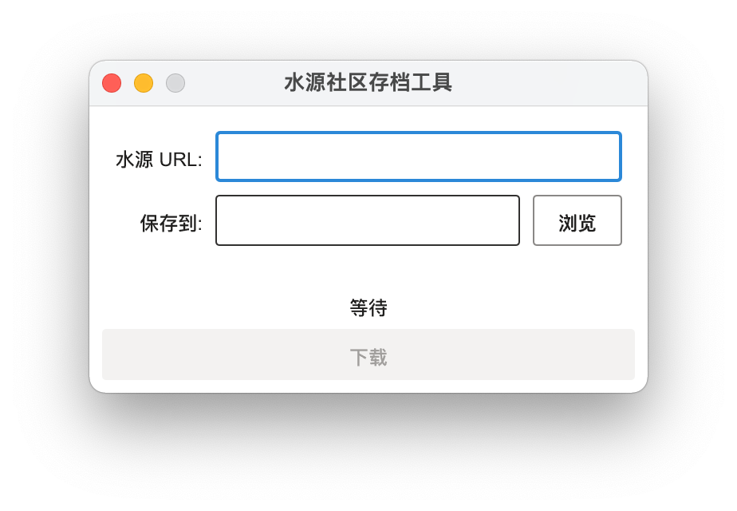

# 水源社区存档工具

一个将上海交通大学[水源社区](https://shuiyuan.sjtu.edu.cn)的文章存档的工具。

## 使用方法

1. 运行下载的 exe (Windows) 或 dmg (Mac) 文件
> 如果系统询问您是否要运行程序，请选择允许。

2. 输入用户名和密码登录。

3. 将要下载的贴子的完整地址粘贴到输入框中，选择保存位置，然后点击下载。

## 许可

本项目遵循 MIT 协议。详情请参见 [LICENSE](LICENSE.txt)。以下文本为节选译注，仅英文原文有法律效力。

> 本软件是“如此”提供的，没有任何形式的明示或暗示的保证，包括但不限于对适销性、特定用途的适用性和不侵权的保证。
> 在任何情况下，作者或版权持有人都不对任何索赔、损害或其他责任负责，
> 无论这些追责来自合同、侵权或其它行为中，还是产生于、源于或有关于本软件以及本软件的使用或其它处置。

# Archiver for Shuiyuan BBS

A tool to archive an article on [Shuiyuan BBS](https://shuiyuan.sjtu.edu.cn) of SJTU.

## Usage

1. Run the downloaded exe (Windows) or dmg (Mac) file.
> If the system asks you whether to run the program, please select "Allow".

2. Enter your username and password, and click "登录" (login).

3. Paste the full URL of the article you want to download into the input box,
select the location to save, and click "下载"(download).

## License

This project is licensed under the [MIT License](LICENSE.txt).