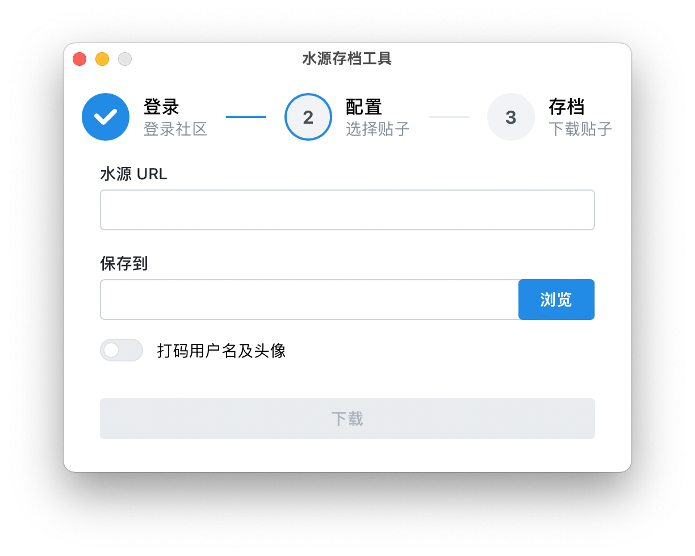

# 维护状态

# 本项目现在已经不再积极维护，并正在征集维护者/替代品，见 [#25](https://github.com/PhotonQuantum/shuiyuan-archiver/issues/25)。

---

# 水源社区存档工具

一个将上海交通大学[水源社区](https://shuiyuan.sjtu.edu.cn)的文章存档的工具。

## 使用方法

1. 下载并安装 msi (Windows) 或 dmg (Mac) 文件。

> 如果系统询问您是否要运行程序，请选择允许。
> 
> Debian 用户可以安装 deb 包，其他 Linux 用户可下载 AppImage，并在 chmod +x 后直接运行

2. 在弹出的浏览器窗口中登录水源论坛，选择授权，并将授权代码按 Ctrl+V 粘贴到程序中。

3. 将要下载的贴子的完整地址粘贴到输入框中，选择保存位置，然后点击下载。

贴子将以 页码.html 的文件名存储。注意在移动存档时，请务必保留 resources 文件夹。

## 许可

本项目遵循 MIT 协议。详情请参见 [LICENSE](LICENSE.txt)。以下文本为节选译注，仅英文原文有法律效力。

> 本软件是“如此”提供的，没有任何形式的明示或暗示的保证，包括但不限于对适销性、特定用途的适用性和不侵权的保证。
> 在任何情况下，作者或版权持有人都不对任何索赔、损害或其他责任负责，
> 无论这些追责来自合同、侵权或其它行为中，还是产生于、源于或有关于本软件以及本软件的使用或其它处置。

# Archiver for Shuiyuan BBS

A tool to archive an article on [Shuiyuan BBS](https://shuiyuan.sjtu.edu.cn) of SJTU.

## Usage

1. Install the downloaded msi (Windows) or dmg (Mac) file.

> If the system asks you whether to run the program, please select "Allow".
> 
> Debian users can install deb packages, and other Linux users can download AppImage and run it directly.

2. Login to the Shuiyuan BBS, click "Authorize" and paste the authorization code into the program.

3. Paste the full URL of the article you want to download into the input box,
select the location to save, and click "下载"(download).

The article will be saved as "{page}.html". Note that when moving the archive, do not delete the "resources" folder.

## License

This project is licensed under the [MIT License](LICENSE.txt).
